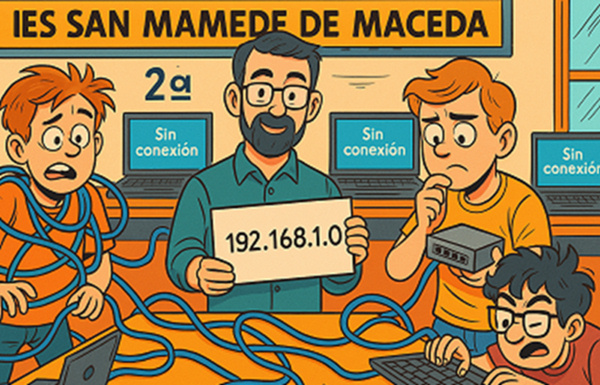

# 🧠 Escape Room Educativo: Misión AR San Mamede

Este proxecto é un Escape Room dixital e interactivo deseñado para alumnado de Secundaria e Formación Profesional no IES San Mamede. Cada proba integra habilidades lóxicas, competencias dixitais e contidos interdisciplinares, promovendo a aprendizaxe activa. Aquí estan as probas para xogar busca o enlace da URL PARA XOGAR

## 🎯 Obxectivos do Proxecto

- Desenvolver o pensamento crítico e a resolución de problemas.
- Traballar en equipo e de forma colaborativa.
- Aplicar contidos curriculares de xeito lúdico e transversal.
- Utilizar tecnoloxía web (HTML, CSS, JS) en contornos educativos.

---

## 🎯 URL PARA XOGAR


## 📁 Estrutura do Proxecto

```
ESCAPEROOM-XERAL/
├── index.html             # Entrada principal SPA
├── js/
│   ├── app.js             # Controlador principal SPA
│   ├── proba1.js          # Lóxica da Proba 1 (ordenar letras)
│   ├── proba2.js          # TrivialTech: preguntas tipo test tecnolóxicas
│   ├── proba3.js          # Emparella conceptos: relación entre elementos
│   ├── proba4.js          # Xeroglíficos interactivos
│   ├── proba5.js          # Ordear cronoloxicamente
│   ├── proba6.js          # Detectar diferenzas visuais
├── css/
│   ├── styles.css         # Estilos comúns
│   ├── proba4.css         # Estilos específicos para proba 4
├── data/
│   ├── proba1.json        # Palabras para ordenar con letra codificada
│   ├── proba2.json        # Preguntas tipo test con opcións e letras
│   ├── proba3.json        # Pares para emparellar conceptos
│   ├── proba5.json        # Preguntas de ordear cronoloxicamente
│   ├── proba6.json        # Imaxes e opcións para detectar diferenzas
├── assets/
│   ├── banner-proba4.jpg  # Banner ilustrativo portada da proba 4
│   ├── proba4/            # Imaxes dos xeroglíficos
│   │   ├── jer1.png
│   │   ├── jer2.png
│   │   └── jer3.png
│   ├── proba6/            # Imaxes modificadas para detectar diferenzas
├── portada-probaX.html    # Portadas introdutorias para cada proba
├── probaX.html            # Contido de cada proba
```

---

## 🧩 Probas dispoñibles

| Proba | Nome                         | Descrición                                                                 |
|-------|------------------------------|----------------------------------------------------------------------------|
| 1     | Ordenar Letras               | Resolver palabras a partir de letras desordenadas                         |
| 2     | TrivialTech                  | Preguntas tipo test sobre tecnoloxía e informática                        |
| 3     | Emparella conceptos          | Relacionar pares de elementos ou termos tecnolóxicos                      |
| 4     | Xeroglíficos Visuais         | Descifrar 3 xeroglíficos para descubrir unha palabra oculta               |
| 5     | Orde Cronolóxica             | Ordenar eventos ou elementos segundo criterio histórico ou lóxico         |
| 6     | Detecta as diferenzas        | Imaxes interactivas para atopar diferenzas (comparar cambios visuais)     |

---

## 🛠 Tecnoloxías empregadas

- HTML5 + CSS3
- JavaScript ES6
- Módulos ES para cargar scripts por proba
- SPA baseada en `js/app.js` + sistema de portadas e probas
- Formatos optimizados para centros educativos e dispositivos móbiles

---

## 🚀 Como executar

1. Clona o repositorio:
```bash
git clone https://github.com/javier-feijoo/SCAPEROOM-XERAL.git
```
2. Abre `index.html` nun navegador moderno (non require servidor local).
3. Fai clic en cada proba para comezar.

---

## 📌 Notas e mantemento

- Desenvolvido por [Javier Feijóo](https://github.com/javier-feijoo) - Departamento de Informática do IES San Mamede.
- Este proxecto é libre para uso educativo, podes adaptalo ás túas necesidades.

---

## 📷 Imaxes de exemplo



---

## 🧠 Clave Final
Cada proba devolve unha letra ou palabra parcial. Ao rematar todas, os/as estudantes poderán reconstruír a clave final para saír do Escape Room.

---

**Versión**: 1.0  
**Licenza**: Creative Commons BY-NC-SA
